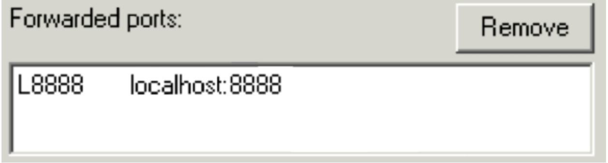

# Retrieve the IP Address of Your Deep Learning AMI Instance and Connect to Your Deep Learning AMI Instance

60.	Open the **Amazon EC2 console**, click **Instances**.
61.	On the **Instances page**, click the Deep Learning Development instance.
62.	In the bottom pane, under **Description** tab, copy the **IPv4 Public IP** to your clipboard and paste the value into a text editor for later use.

## Connect to Your Deep Learning AMI Instance from a Windows Machine

You will set up an SSH tunnel in your PuTTY client in Windows. For security reasons, the Jupyter notebook is only available on the instance's local webserver `http://localhost:port` and is not published on the Internet. To connect to the local webserver on the instance, you can create an SSH tunnel between your computer and the instance (this is also known as port forwarding). If you do not have PuTTY installed on your computer, download it from online.  
63.	Open **PuTTYgen**.  
64.	Click **Load**. Open DeepL.pem file.  
65.	Click **Save private key**. It is fine to save it without a passphrase to protect it. Save it to a safe and accessible location with name DeepL.ppk, for example.   
66.	Launch **PuTTY** by running the putty.exe file you downloaded.  
67.	For **Host Name (or IP address)**, type ec2-user@ and then paste the IP address of the instance that you copied earlier. It should look like: `ec2-user@11.22.33.44`.  
68.	In the navigation panel, expand **SSH** and click **Auth**.  
69.	In the **Private key file for authentication box**, browse to the .ppk file that you downloaded earlier, then click **Open**.  
70.	In the navigation panel, click **Tunnels**.  
First, you will forward port 8888 to the remote port 8888 for Jupyter Notebooks:  
71.	For **Source port**, type: 8888  
72.	For **Destination**, type: localhost:8888  
73.	Click **Add**.  
The configuration should look like this:


 
74.	Click **Open** to start the session.
75.	If prompted to cache the server's host key, click **Yes**. If the connection is not successful, the instance might still be launching. Wait two minutes then try connecting again by clicking the PuTTY icon in the top-left corner of the PuTTY window and selecting **Restart session**. If you are prompted for a username, type: ec2-usera.

## Connect to Your Deep Learning AMI Instance from a Mac or Linux Machine

76.	Start a new **Terminal** session on your computer. 
77.	Run the following command, replacing **PATH-TO-PEM.pem** with your ***.PEM** key path: 

```r
chmod 400 PATH-TO-PEM.pem 
```
Example: 

```r
chmod 400 /keys/qwiklabs1234.pem 
```
78.	Run the following command, replacing the **PATH-TO-PEM.pem** with your ***.PEM** key and replacing **YOUR-IP-ADDRESS** with the **instance IP address** you copied earlier: 

```r
ssh -i PATH-TO-PEM.pem -L 8888:localhost:8888 
ec2-user@YOUR-IP-ADDRESS 
```
For example: 

```r
ssh -i /keys/qwikLABS-L1234-12345.pem -L 8888:localhost:8888 
ec2-user@11.22.33.44
```
79.	If prompted to continue connecting, type: yes.
