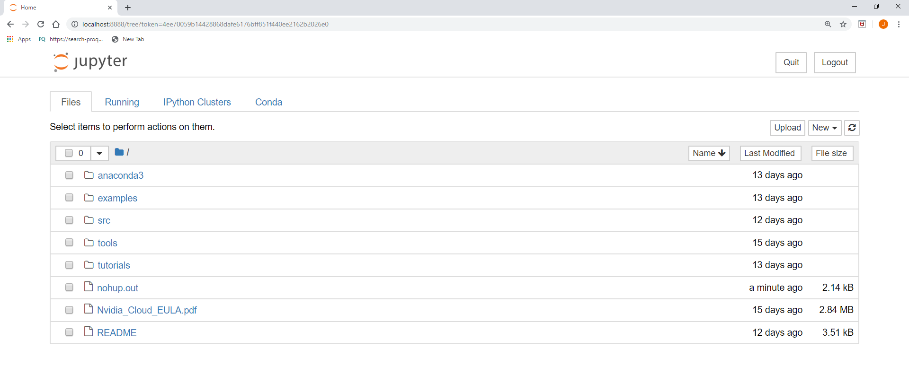

# Explore Amazon Deep Learning AMI and Connect to a Jupyter Notebook

Jupyter notebooks are documents that allow you to create and share documents that contain both code as well as rich text elements such as equations. If you are unfamiliar with Jupyter notebooks, see Jupyter notebook docs online.  
80.	In your SSH session, you will find various deep learning frameworks like MXNet, TensorFlow, Keras as well as Anaconda installed on the deep learning AMI.  
81.	Type `source activate tensorflow_p36` (you could choose the framework you want to activate) in your SSH session.  
82.	Type `nvidia-smi -L` to check the availability of GPU on the instance. Your EC2 instance has a Nvidia GPU processor.  
83.	To start a Jupyter notebook, type `nohup jupyter notebook --no-browser &`  
Press **Enter** if the command-line hangs while running.  
84.	To view the output of the previous command, type `tail nohup.out`.   
You should see a message like this: `Copy/paste this URL into your browser` when you connect for the first time, to login with a token: `http://localhost:8888/?token=xxxx`.  
If you did not see this output, wait 30 seconds and run the command again until it appears.  
85.	**Copy** the URL from the terminal and **paste** it into a new web browser tab.  
86.	You should see the following page (or similar page):

 
It might take a minute for the notebook page to appear. Give it time to fully load.  
87.	To create a Jupyter notebook, click **New**, then click **Python3**. A new tab will open that will display a Jupyter Notebook. You will next create a deep learning model in this notebook.  
